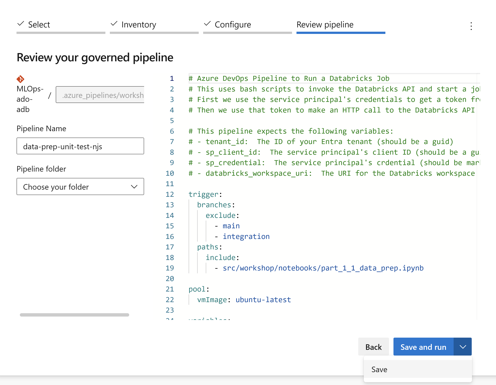
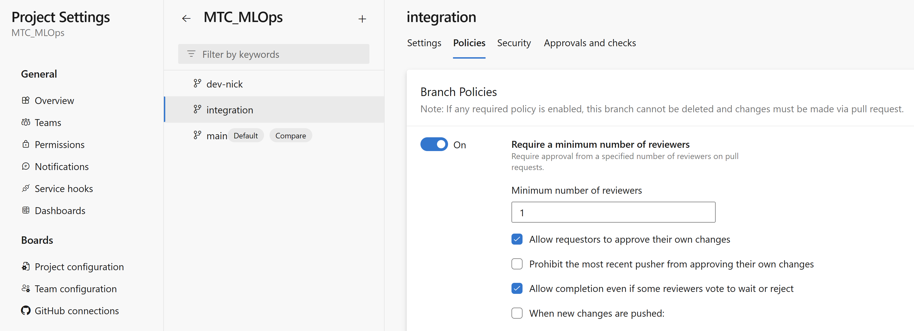

# Part 0: Workshop Environment Setup
> NOTE: The Workshop is designed to take place in a customer environment and requires an Azure AD Service Principal, including the Azure AD token for the Service Principal. Many data science and ML platform teams will need to submit a service request for a Service Principal. Plan in enough time for this service request to be processed.

Read the Workshop scenario overview [here](../README.md#workshop-scenario).

The steps described here in Part 0 prepare Azure Databricks, Azure DevOps, and an Azure AD Service Principal to serve as the MLOps platform. These steps are to be performed by the platform administrators so that data scientists can start with Part 1 without getting overwhelmed with the infrastructure details involved in getting the core pieces of the MLOps platform linked together.

In general, expect the platform setup steps in Part 0 to take as long or longer than the workshop steps in Parts 1-5. You may need multiple, multi-hour sessions to complete Part 0, especially if you run into needs for access rights that only admins can grant.

It is preferable to use a resource group and set of resources that are isolated from other work, so that the data and model assets that workshop participants create don't litter your work environment with workshop assets, and so that you can tear down the workshop environment upon completion.

## Pre-requisites for Part 0
- An Azure Account and Subscription
- Permission to create, or access to, an Azure AD Service Principal
- An understanding of:
    - Azure Subscriptions and Resource Groups
    - Azure AD Service Principals
    - Git mechanics (in this workshop we use Azure Repos and Databricks Repos)

## Steps

1. Create a Service Principal in Azure Active Directory
2. Add the Service Principal to your Azure Databricks workspace
3. Add the Service Principal to Azure DevOps
4. Create a variable group in Azure DevOps
5. Register Azure Pipelines
6. Grant workshop participants Azure DevOps permissions and user access
7. Set up branch protection policies in Azure Repo
8. Generate and store data
9. Confirm participant access to a Databricks cluster with ML runtime
10. Generate baseline model and grant Model manage permissions to team
11. Confirm `main` and `integration` branches of repo are up to date
12. Dry run the workshop to double check environment setup

## 1. Create a Service Principal in Azure Active Directory

> NOTE: You can skip this section if you've been provided an Azure AD Service Principal by an Admin.

## 2. Add the Service Principal to your Azure Databricks workspace

## 3. Add the Service Principal to Azure DevOps

## 4. Create a variable group in Azure DevOps

You may either grant open access to pipelines, or just to the three pipelines that you register.

### 4.1 Choose ADO "utility" user and create PAT (Personal Access Token)

You are going to create a PAT for some "utility" user in the Azure DevOps project to allow your code access the Azure Repo in the Azure DevOps project. (There is a current Databricks limitation in directly granting the Service Principal git credentials with any git provider.)

Use this user for `ado_username` and `ado_username_pat`.

An alternative approach here may be to use a service connection, which you may use as a substitute if you are able.

## 5. Register Azure Pipelines

Go to the Pipelines section and select "New pipeline".

Select your MLOps-ado-adb repo.

Configure your pipeline using an "Existing Azure Pipelines YAML file":

Select the `.azure_pipelines/workshop_unit_test.yml` Azure Pipelines YAML file in your branch of the repo, (not in the main branch).

Give your pipeline a Pipeline Name of "Data Prep Unit Test Pipeline", the click the "Save and run" button to manually trigger the pipeline.

Select `/.azure_pipelines/workshop_unit_test.yml`.

Save and rename to "Data Prep Unit Test Pipeline."

Select `/.azure_pipelines/ci.yml`.

Save and rename to "Continuous Integration Pipeline."

Select `/.azure_pipelines/cd.yml`.

Save and rename to "Continuous Delivery Pipeline."

## 6. Grant workshop participants Azure DevOps permissions and user access
Be sure that workshop participants can access the Azure Repo. You may need to grant participants Basic User Access rights, in addition to Contributor permissions, so they can see and use the Azure Repo.

Make sure participants also are able to create new branches in the repo, as they do this in Part 1.

## 7. Set up branch protection policies in Azure Repo
### 7.1 Integration branch policies
Require approval of merges to `integration`, which triggers the CI pipeline, permitting requestor to approve their own changes.

### 7.2 Main branch policies
Require approval from two people for merges to `main`, which triggers the CD pipeline, and prohibit the pusher from approving their own changes.

## 8. Generate and store data

In Databricks, navigate to your Databricks Repo and to the notebook `/src/workshop/notebooks/part_0_create_datasets` and run it.

## 9. Confirm participant access to a Databricks cluster with ML runtime
Workshop participants will interactively run notebooks that depend on `mlflow` being installed: make sure participants have access to an ML runtime cluster.

## 10. Generate baseline model and grant Model manage permissions to team
In Databricks, navigate to the repo and run the following three notebooks in sequence:

1. `/src/workshop/notebooks/part_1_1_data_prep.ipynb`
2. `/src/workshop/notebooks/part_1_2_training.ipynb`
3. `/src/workshop/notebooks/part_1_3_evaluating.ipynb`

Doing so will create a model named "wine_quality".
Navigate to the Models section of Databricks and change the permissions on the "wine_quality" model so that all users can Manage.

## 11. Confirm `main` and `integration` branches of repo are up to date
If you made any changes to the files so they run in your environment as you wish, be sure to commit those to version control and make sure both the `main` and `integration` branches of the repo reflect your most recent changes.

## 12. Dry run the workshop to double check environment setup
To ensure you have set up the environment correctly, have someone with only the same permissions as workshop participants do a dry run of the workshop content in Parts 1 through 5. This will take a few hours for one person, but if it uncovers problems that need resolving, resolving it now before you have a room or teams call full of workshop participants will save time and frustration for the large group.

## Congratulations
You have set up the environment to enable workshop participants to execute the steps described in Parts 1 through 5.

## [Go to Part 1](part_1.md)
