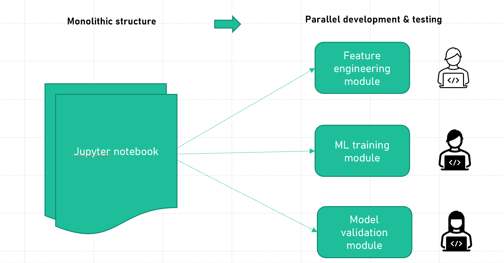
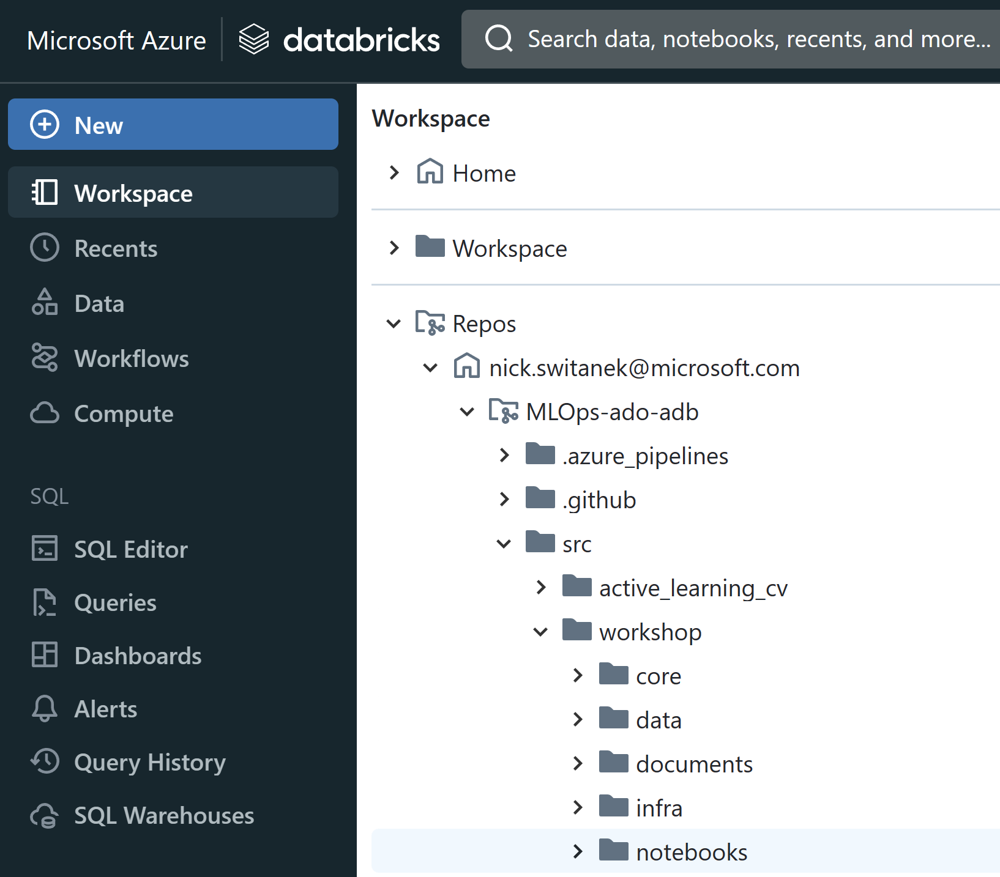
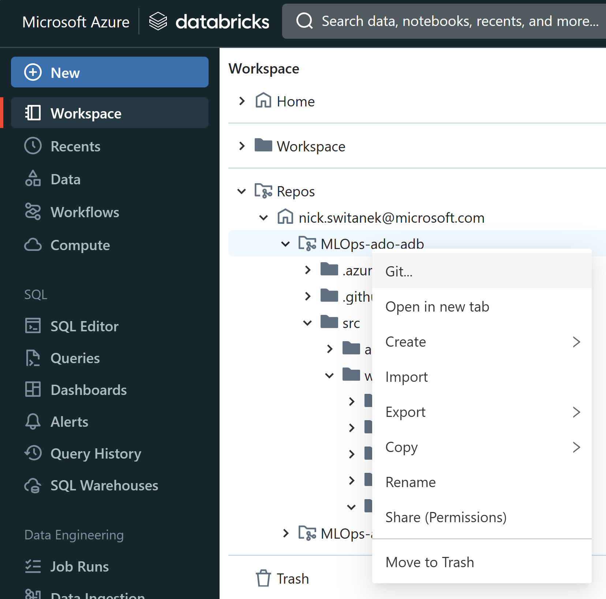
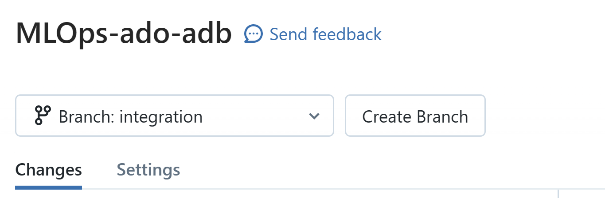
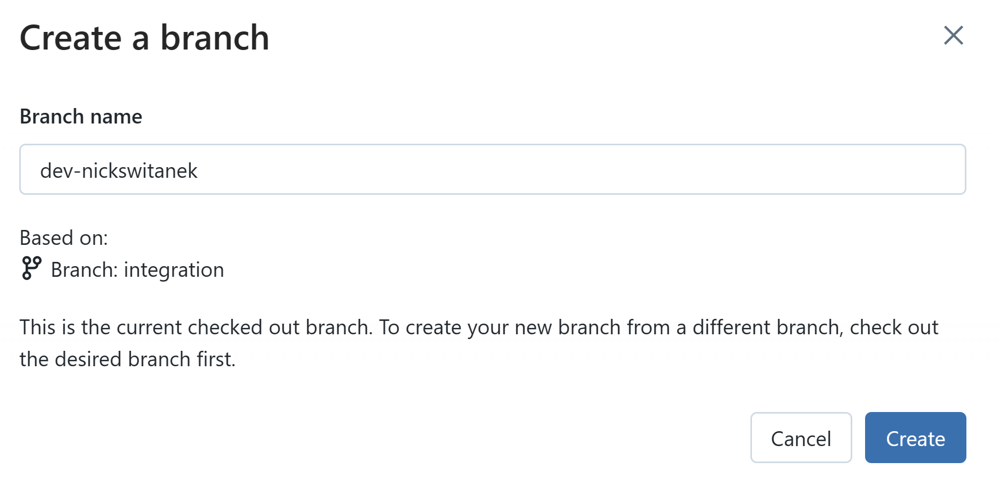
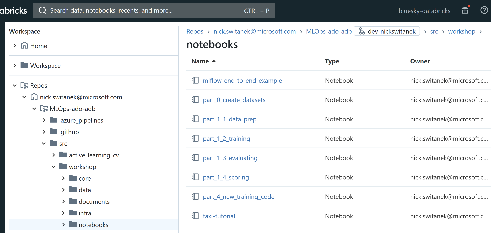
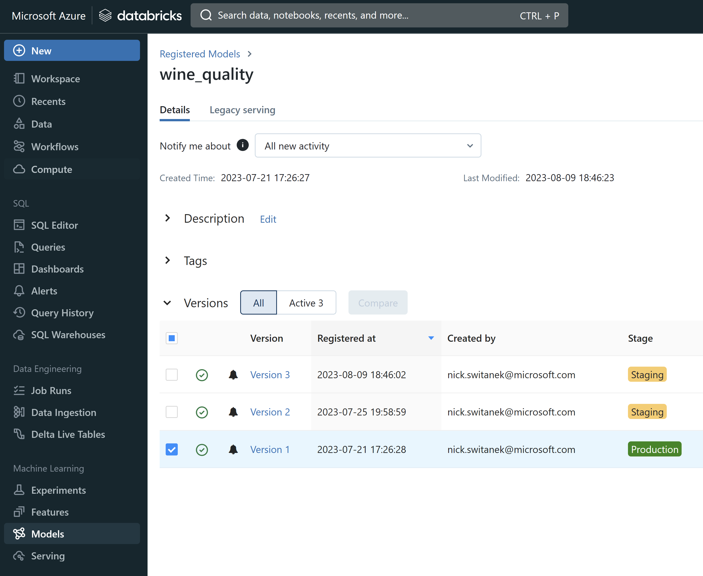

# Part 1: Structure code for fast iterative development
## Pre-requisites
- Complete [Part 0](part_0.md) to set up the required resources and permissions in Azure. 

## Summary 
Your team has been working on a new ML problem. The team has done initial exploratory work preparing the data and fitting models and has now come to a state that the solution direction is mostly solidified. Now it is time to structure the work so that workflow that produces a deployed model is hardened and made maintainable, while also enabling the teamto iterate on it, systematically and quickly, to continue to improve on the deployable solution.   

So far team members have been working mostly independently in Azure Databricks notebooks that handle their end-to-end model development workflow. To enable more effective collaboration for continuous improvement and easier maintenance of the workflow, they will break the workflow into separately maintainable but linked parts.

As a first step towards MLOps, the team needs to do the following:  

- Modularize: A single, end-to-end Databricks notebook is refactored into a linked sequence of smaller, "module" notebooks that each focus on a particular stage in the overall model development lifecycle. Modular notebooks can be more easily developed and tested independently and in parallel by multiple members. 
- Parameterize: The modular notebooks are parameterized so that they be rerun with different parameter values to exhibit different behavior. We can thus use parameters to, for example, load only ten days of data during unit testing, setting parameter `days=10`, while six months of data during model training that happens during integration testing in the CI pipeline, `days=180`.

To illustrate how the process works, the monolithic notebook was refactored into a feature engineering notebook, a model training notebook, and an evaluation notebook. You will run these modules individually to see how they work.

 

## Steps

> Note: You can review notebooks and run the following tasks in the Databricks Repo in your Azure Databricks workspace. 

0. Navigate to `Repos/{your Databricks user account}/MLOps-ado-adb/src/workshop/notebooks`. Depending on your version of the Databricks UI, Repos may either be found within your Workspace tab in the sidebar, or instead be found in a separate tab.

1. Familiarize yourself with the steps in the
  notebook in the Databricks Repo at `/notebooks/mlflow-end-to-end-example.ipynb`. The notebook, available in the [Azure Databricks documentation](https://learn.microsoft.com/en-us/azure/databricks/mlflow/end-to-end-example), shows the end-to-end data preparation and model building workflow in a single notebook. 
  
  **There is no need to run this end-to-end notebook as part of this workshop.**
   
2. Ask yourself, and discuss with your team, why putting the entire workflow into a single notebook is a challenge to scalable and repeatable ML development.

Now observe how the monolithic notebook was refactored into a data prep or feature engineering module, a model training module, and a model evaluation module so that each step in the overall process can be developed and run independently. One thing to note about the new modules is that they contain both the code from the monolithic notebook, as well as a definition of the interface, the inputs and outputs needed and produced by the code, so that the modules can be linked together to replicate the entire workflow represented in the monolithic notebook. Additionally, modules can be parameterized so that they behave differently depending on what parameters are passed to them, either during interactive testing, or later on in this workshop, by pipelines that run at different stages in the MLOps lifecycle.

3. The basic version control and git branching strategy we'll use is as follows:
- The `main` branch contains all the code used to develop the model in production 
- The `integration` branch starts as a complete copy of `main`
- Data scientists and data engineers create development or feature branches off of `integration` with names like `dev-{yourname}` to experiment with changes to some part of the workflow, in the hopes of finding an improvement in the models produced by the workflow
- If results are promising, the work done in `dev-{yourname}` is merged into `integration`
- If the new work results in a model that outperforms the production model in `main`, then the new code in `integration` becomes the new `main`, and the model is updated to reflect the new ML model training workflow.

4. In your Databricks Repo, create your own development branch off of the `integration` branch where you can make and track changes. This branch will be your development area to create and test new code or pipelines before committing or merging the code back into a common branch, such as `integration`.

To do this, right-click the `/MLOps-ado-adb` folder in your Databricks Repos section of your Workspace, and select the "Git..." option from the drop-down menu.

In the next screen, make sure the `integration` branch is selected from the drop-down menu.

Select "Create Branch." In the next screen, type `dev-{yourname}` in the "Branch name" field and "Create" the branch based on "Branch: integration".

After you've created the branch, close the branch window and confirm that `dev-{yourname}` appears in the filepath at the top of the Repos view in Azure Databrcks:

While your dev branch is selected, you'll be looking at version-controlled copies of the files from the integration branch. Any changes you make to the files while on your branch will only be reflected in your branch, and not in other branches. 

Next let's review those task-focused notebooks that were refactored from the end-to-end monolithic notebook.

5. Review the refactored data preparation logic in the notebook at `/notebooks/part_1_1_data_prep.ipynb`.

This modular notebook focused on data prep does the following:

- Loads the raw data from dbfs.
- Checks for missing values.
- Does some basic data visualizations.
- Creates a new, binary outcome variable.
- Saves the prepared data to dbfs.

At the top of the notebook, you'll see comments indicating where to change some parameters regarding the path to where you write the prepared dataset. We do this in the context of the workshop so you aren't overwriting the datasets created by other workshop participants.

Run this notebook.

6. Review the refactored model training logic in the `/notebooks/part_1_2_training.ipynb` notebook. 

This modular notebook focused on model training does the following:

- Loads the data prepared in the data prep notebook.
- Splits the data for training and validation.
- Builds a baseline model and 
- Registers the model to the Model Registry and labels it as "Staging"

Change the parameters at the top of the notebook to read the dataset from where you write it in the data prep notebook, and to establish a mlflow model path specific to you. 

Run this notebook.

7. Review the refactored model evaluation logic in the `notebooks/part_1_3_evaluating.ipynb` notebook.

This modular notebook focused on model evaluation does the following:

- Load the test data.
- Load the model registered to staging in the training step.
- Use the trained model to predict on the test data and generate model evaluation metrics.
- If no prior trained model exists, the model will be registered as a baseline model in production.
- If a production model is found, the evaluation metrics for that model will be compared against metrics for the newly trained model and if the new model's metrics surpass those of the current production model, the new model will be registered to production. If not, the notebook exits and raises an exception. 

Change the parameters at the top of the evaluation notebook to read the model from the path in the mlflow model registry where you saved it in the training notebook.

Run this notebook.

8. Navigate to the Models section of Azure Databricks to see that a model is produced with name `wine_quality_{yourname}` and labeled as Production. This will be your baseline model that your future iterative development of parts of the ML workflow will aim to beat.

## Success criteria
- Data prep notebook runs and writes prepared data to dbfs.
- Model training notebook creates and registers a model.
- Model evaluation notebook either promotes a model to production or exits.

## [Go to Part 2](part_2.md)

