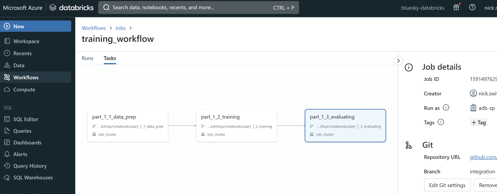
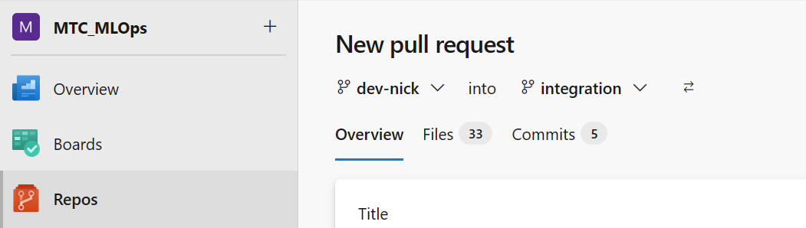

# Part 4: Continuous Integration (CI)

## Pre-requisites
- Complete [Part 0](part_0.md), [Part 1](part_1.md), [Part 2](part_2.md), [Part 3](part_3.md)

## Summary
After successfully using Azure Pipelines to automate unit testing of changes made to an individual notebook that represents a step in the overall model development workflow, your team wants to test that the changed notebook also integrates with the overall workflow. Continuous Integration (CI) is the process of developing, testing, integrating, and evaluating new features in a staging environment, as a way of confirming they are ready for deployment and release. 


## Steps:
1. The notebook that was unit tested in Part 3 is also part of an overall end-to-end workflow. In Databricks you may have linked multiple notebook jobs together into a workflow using the UI. Here we will specify a `training_workflow` using code we commit to the Repo.  

We use the workflow to link the three modular notebooks into a sequence of steps that depend on the success of prior steps, and that the notebooks reflect the code committed to the `integration` branch of the Azure Repo. So if we want to test whether the new code in a notebook integrates with the other pieces of this workflow, the new code will need to make its way in `integration`. The workflow looks like this.




2. The logic of integration testing is that the entire Databricks training workflow should be triggered if the new code has passed unit testing and been merged into the `integration` branch. Let's set the Azure Pipeline triggers to watch for an approved merge into `integration`.

```
# .azure_pipelines/ci.yml

trigger:
  branches:
    exclude:
      - main
    include:
      - integration
  paths:
    include:
      - src/workshop/notebooks/part_1_1_data_prep.ipynb
      - src/workshop/notebooks/part_1_2_training.ipynb
      - src/workshop/notebooks/part_1_3_evaluating.ipynb
      - .azure_pipelines/ci.yml

# ...remainder of the Azure Pipeline config for CI
```

With the Azure Pipeline triggers thus configured, now if the unit test passed on notebook code change, then to get that code into the `integration` branch we need to execute a Pull PR to merge dev branch into integration. And if the PR is merged to the `integration` branch, the continuous integration (CI) Pipeline will automatically run the Databricks workflow job that includes an evaluation step.

Note that we have included the json that specifies the Databricks model training workflow right in the CI pipeline configuration. 

```
# .azure_pipelines/ci.yml

# pipeline config code
# ...

# databricks workflow config
      "run_name": "Model Training Workflow - '"$(BRANCH_NAME)"'",
      "tasks": [
        {
          "task_key": "data_prep",
          "notebook_task": {
            "notebook_path": "src/workshop/notebooks/part_1_1_data_prep",
            "source": "GIT",
            "base_parameters": {
              "run_name": "'"$(BRANCH_NAME)"'"
            }
          },
          "new_cluster": '"$cluster_def"'
        },
        {
          "task_key": "model_training",
          "notebook_task": {
            "notebook_path": "src/workshop/notebooks/part_1_2_training",
            "source": "GIT",
            "base_parameters": {
              "run_name": "'"$(BRANCH_NAME)"'"
            }
          },
          "depends_on": [ {"task_key": "data_prep"} ],
          "new_cluster": '"$cluster_def"'
        },
        {
          "task_key": "model_evaluation",
          "notebook_task": {
            "notebook_path": "src/workshop/notebooks/part_1_3_evaluating",
            "source": "GIT",
            "base_parameters": {
              "run_name": "'"$(BRANCH_NAME)"'",
              "devops_action": "Integration"
            }
          },
          "depends_on": [ {"task_key": "model_training"} ],
          "new_cluster": '"$cluster_def"'
        }
      
      ],

# remainder of pipeline config file
# ...
```

3. Now that we have the CI pipeline configured, let's make a meaningful change to the training notebook. Remember from Part 1 that the evaluation notebook will exit if the model trained by the Databricks training workflow doesn't outperform the current model in production when compared on test data. If the evaluation notebook exits, then the workflow will not complete and the CI pipeline will fail, as is desired. So let's update the training notebook to include a technique likely to outperform the baseline model, namely hyperparameter search.

Navigate to your Databricks Repo, to `/notebooks/part_1_2_training`. Make sure you are on the development branch you created in Part 1. In the `/notebooks` folder you'll find some sample code for hyperparameter search and model selection in `/notebooks/part_4_new_training_code`. Copy this code into the model training cell in the original `part_1_2_training`.

4. Once you're sure the edited notebook will run, Commit and Push your changes from the Databricks Repo to Azure Repo, using the steps you practiced in Part 3. 

> Question: Will your commit and push trigger the unit test Azure Pipeline? Why or why not? Is this desirable or not? How could you improve the situation?

5. Now you've pushed the code to the Azure Repo, but it's still on your dev branch. To trigger the CI pipeline, you need to make a pull request (PR) from your personal dev branch, which is named something like `dev-{yourname}`, to the `integration` branch. Pull Request management is not currently supported in Databricks Repos, so you'll need to go to the Azure Repo in Azure DevOps to make a PR.

    >Action Items:
    >- Navigate to your Azure Repo in Azure DevOps 
    >- Click on the "Pull requests" tab and then click on "New pull request". 
    >
    >- Specify that your pull request is to merge  `yourname-dev` into the `integration` branch.  
  
  

    >- Give the PR a title and brief description, then click on "Create" pull request.

6. Merge the pull request into integration to trigger CI pipeline. (Self-merge of PRs to integration allowed by branch protection rules)

The merge to the integration branch triggers the workshop_ci workflow. Click on the Actions tab on your repository and you should see CI workflow running. Click and examine all the steps, note that the CI Workflow is running the steps in the `ci.yml`. 

    The CI workflow has multiple steps, including logging in to Azure, accessing the relevant code from the remote git repository in Azure Repos, and specifying and running the Databricks training model pipeline. 
    
    As a part of this workflow, the updated model from our current changes is compared to our best previous model and if it performs better it passes the evaluation step, which is reflected in the evaluation notebook.


7. Confirm that Azure Pipelines CI pipeline triggers Databricks workflow job.


8. If workflow completes successfully, and the model evaluation step shows improvement, then the new model produced by the workflow involving the notebooks is registered and promoted to the "Staging" slot in the model registry. 


9. If your new model training code passed the integration testing (and the unit testing before that), then it seems likely you've made an improvement to the model training workflow and the new workflow should be replace the old one reflected in the `main` branch. In Part 5, we'll establish a continuous deployment (CD) Azure Pipeline and set up appropriate triggers to automate and manage the promotion of the new workflow to the production, `main` branch.


## Success criteria
- Trigger CI workflow when a pull request is merged to the integration branch
- Successfully run the CI pipeline which also runs the Databricks end-to-end workflow
- Check in Databricks whether the new model performs well enough to potentially replace the current best model.


## [Go to Part 5](part_5.md)

