# Part 0: Workshop Environment Setup
> Note: Read the Workshop scenario overview [here](https://github.com/microsoft/MLOpsTemplate/blob/main/src/workshop/README.md#workshop-scenario)

## Goal
- Setup Azure ML workspace and components
- Setup github account, a personal access token and configure settings
- Setup local python development environment
- Generate and register data for the workshop
- Setup SP (Service Principal)

## Pre-requisites for part 0
- An Azure Account and Subscription
- An understanding of:
    - Azure Subscriptions and Resource Groups
    - Service Principals
    - Github mechanics (creating an account, forking a repo, etc.)

## Steps

0. [Check list](./part_tips.md)

1. [Create Azure Machine Learning resources in Azure](#1-Create-resources-in-Azure)

2. [Setup Github account and settings](#2-Setup-github-account-and-settings)

3. [Setup your development environment](#3-Choose-your-development-environment)
    - Option A: Use CI as your local in AML
    - Option B: Use your local machine (PC or MAC)

4. [Configure secret in your Github account](#4-Configure-secret-in-your-Github-account)
    - Create a Personal Accesss Token (PAT)
    - Add a Service Principal (SP) to your repo in Github

> Note: For a detailed video walk-through of the process, click on the video below to walk through Steps 0 to 3.
> [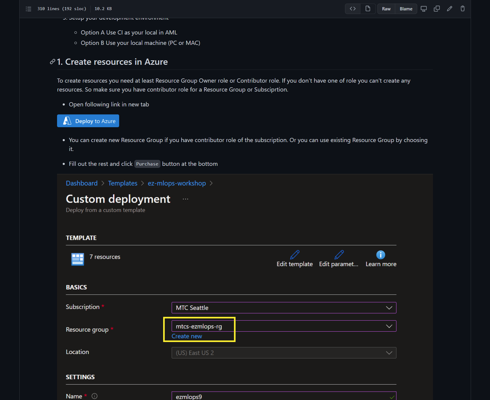](https://youtu.be/k9ExpebwR18)


## 1. Create resources in Azure

> IMPORTANT: You can skip this section if you've been provided a subscription already setup by Microsoft.

>Note: To create resources you need an `Owner` or `Contributor` role for your subscription or resource group. If you don't have either one of these roles, you cannot create any of the following resources.

- 1.1 Open the following link in a new tab.

    [](https://portal.azure.com/#create/Microsoft.Template/uri/https%3A%2F%2Fraw.githubusercontent.com%2Fmicrosoft%2FMLOpsTemplate%2Fmain%2Fsrc%2Fworkshop%2Fdocuments%2FIaC%2Fiac_EZ_MLOps.json)

- 1.2 Fill out the rest and click the `Create` button at the bottom.

    

    > Note: The provisioning will take 4 mins to 5 mins. If you want to see the progress of the provisioning, you can click the 'Notification' icon. When the provisioning is done, leave the tab open (don't close it!). You can leave it and open a new tab in your browser for the next step.
    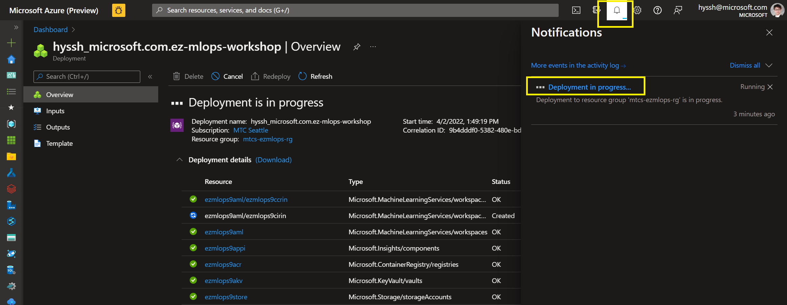

    > IMPORTANT: If this deployment fails, you cannot do the following steps in the workshop. Please inform your CSA or lab instructor with the error message.

## 2. Setup Github Account and Settings

- 2.1 From the new browser tab, go to [Github](https://github.com/) and login to your account.
    > Note: If you don't have an account for Github, please sign up. The workshop can't be done without a Github account.

- 2.2 After the login, go to [https://github.com/microsoft/MLOpsTemplate](https://github.com/microsoft/MLOpsTemplate) and click `Fork`.
    

    > Note: You will have the same repository (`MLOpsTemplate`) under your Github account name.
    > Leave the tab open and **do not** close it yet. You will come back to your repository.

## 3. Choose your development environment
In this step you will clone the above forked repository into a development environment. You can choose between either using the Compute Instance (CI) in Azure Machine Learning (this was pre-created as part of the above steps) or your local laptop. We also provide a 3rd option using the Azure Cloud Shell, but this isn't a recommended approach for actual development, but is an alternative to run basic scripts. Based on this choice, follow the related instructions:
- [Option A. Use CI in AML](#Option-A-Use-Compute-Instance-in-AML)
- [Option B. Use Your laptop(PC/MAC)](#Option-B-Use-your-laptop-(PC/MAC))
- [Option C. Use the Azure Cloud Shell](#Option-C-Use-the-Azure-Cloud-Shell)

### Option A. Use Compute Instance in AML

- A1. Go to [Azure Machine Learning Studio](https://ml.azure.com)

- A2. Go to __Compute__ > __Compute Instance__

- A3. Click new __Terminal link__

- A4. Clone __your__ 'MLOpsTemplate' repo in the Terminal of Compute Instance

    - Make sure you have forked the repo to your repository
    - Before you run following command, update the _{YOURGITHUBACCOUNT}_ part with your GitHub handle (look at your browser URL for the repo you forked earlier to get this information)
    - Run the following command to clone the repo:
     ```bash
     git clone https://github.com/{YOURGITHUBACCOUNT}/MLOpsTemplate.git
     ```

> Note: Make sure you are running the command from a similar path structure like below:
> `~/cloudfiles/code/Users/YOURALIAS$`

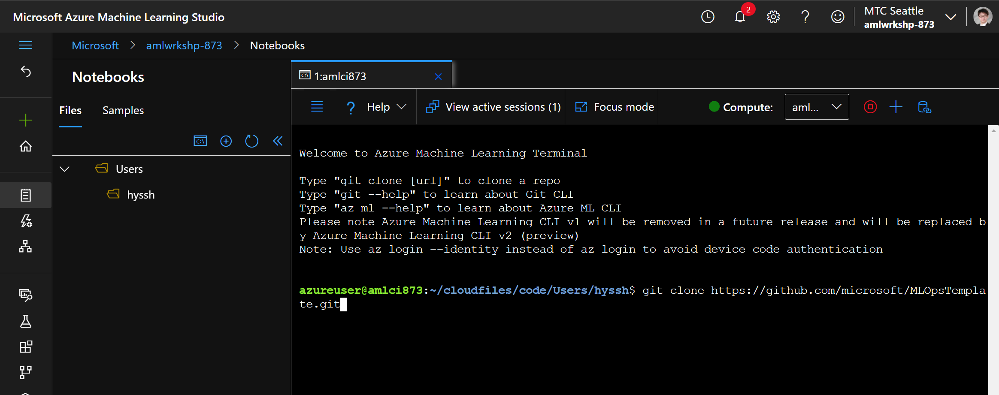

- A5. Generate and register data for the workshop

    - Update arguments "_NAMES_ and _ID_" accordingly and then run following commands from the Terminal

        ```bash
        cd ./MLOpsTemplate/src/workshop
        conda env create -f conda-local.yml
        conda activate mlops-workshop-local
        python ./data/create_datasets.py --datastore_name workspaceblobstore --ml_workspace_name "AML_WS_NAME" --sub_id "SUBSCRIPTION_ID" --resourcegroup_name "RG_NAME"
        ```
        
> Note: You can find the __Resource Group Name, Azure Machine Learning Name__ and the __Location__ from Azure portal.
> 

- A6. Install az ml CLI v2
    - Run the following command to see the `az extension`
        ```bash 
        az extension list
        ```
    - If you see the `azure-cli-ml` extension, remove it by running the following command: 
         ```bash 
         az extension remove -n azure-cli-ml
         ```
    - If you see `ml` extension, remove it by running the following command:
         ```bash 
         az extension remove -n ml
         ```
    - Install the latest az `ml` CLI v2 extension by running the following command:
        ```bash 
        az extension add -n ml -y --version 2.2.1
        ```

- A7. Setup az cli
    - Run the following command from the Terminal:
        ```bash
        az login
        ```
        If you have access to more than 1 tenants, it's advisable to use the syntax below with a designated tenant id to logon to the right tenant
        ```bash
        az login --tenant "<YOUR_TENANT_ID>"
        ```
        Use the code and follow the instruction to finish the login.
    > Note: You need to login in and be authenticated to use the `az cli` extension.
        
        After copy the __code__ and go to the link, [https://microsoft.com/devicelogin](https://microsoft.com/devicelogin). 
        


- A8. Configure the subscription and Azure Machine Learning Workspace
    ```bash
    az account set -s "<YOUR_SUBSCRIPTION_NAME>"
    az configure --defaults group="<YOUR_RG_NAME>" workspace="<YOUR_AML_NAME>" location="<YOUR_REGION_NAME>"
    az configure -l -o table
    ```
    
    > Note: You can find the __Resource Group Name__, __Azure Machine Learning Name__ and __the Location__ from the user profile in the AML Studio.
    

    > Note: The results should look like the following:
    

- A9. Create a Service Principal (SP)

    > If you have a Service Principal, please use the existing one. Ignore this step and go to next step 4.
    > If you don't have the Service Principal, please follow this step.
    
    > Note: In case you don't have permission to create SP, please reach out to your Azure infra/security team to get help.
    
    - Get the following information:
        - Your Azure SubscriptionID where your Azure Machine Learning service is 
        - Resource Group Name where your Azure Machine Learning service is 
        - (Random) Name for the Service Principal you're about to create

    - To create a Service Principal, run the following command:

    ```bash
    az ad sp create-for-rbac --name {REPLACE_SPNAME} --role contributor --scopes /subscriptions/{REPLACE_SUBSCRIPTIONID}/resourceGroups/{REPLACE_RESOURCEGROUPNAME} --sdk-auth
    ```
    
    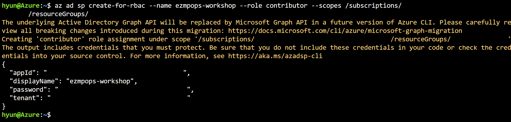

    > IMPORTANT: copy/save the entire json output of that command, we will need this to setup the GitHub Secret that will enable to login into Azure using this Service Principal

    > Note: Once done, leave the terminal open. Do not terminate it and head to [the next step](#4-Configure-secret-in-your-Github-account).

### Option B. Use your laptop (PC/MAC)
> Note: If you followed Option A, you don't need Option B.

- B1. Create a local python development environment

    - [Install Conda](https://docs.conda.io/projects/conda/en/latest/user-guide/install/index.html), [git](https://git-scm.com/downloads?msclkid=1f5aa675b42811ecb1979c5fb8e69812) and your prefered IDE, for example, [VS Code](https://code.visualstudio.com/Download?msclkid=32cd8937b42811ec9681883c942b2912)

        - Use VSCode and VSCode for python if possible

- B2. Open your local terminal

- B3. [Install az CLI](https://docs.microsoft.com/en-us/cli/azure/install-azure-cli#install)

- B4. Install az ml CLI v2
    - Run the following commands from your local terminal
    - Check az extension by running following command

        ```bash 
        az extension list
        ```

        - If you see azure-cli-ml extension, remove it by running following commnad. If you dont see, then move to next step

            ```bash 
            az extension remove -n azure-cli-ml
            ```
        
    - If you don't see ml 2.#.# form the extension list, install az ml CLI v2

        ```bash 
        az extension add -n ml -y --version 2.2.1
        ```

- B5. Setup az cli

    - Run the following command from the Termianl

        ```bash
        az login
        ```
        If you have access to more than 1 tenants, it's advisable to use the syntax below with a designated tenant id to logon to the right tenant
        ```bash
        az login --tenant "<YOUR_TENANT_ID>"
        ```
    - You need to follow the guide to use `az cli` for the lab

        

        After copying the __code__ from the terminal, open a new tab, go to the link, [https://microsoft.com/devicelogin](https://microsoft.com/devicelogin).
        
        Use the code and follow the instructions to finish the login.

- B6. After logging into the `az cli`, come back to your terminal and configure the subscription and Azure Machine Learning Workspace by running the following commands:

    ```bash
    az account set -s "<YOUR_SUBSCRIPTION_NAME>"
    az configure --defaults group="<YOUR_RG_NAME>" workspace="<YOUR_AML_NAME>" location="<YOUR_REGION_NAME>"
    az configure -l -o table
    ```
    
> Note: You can find the __Resource Group Name, Azure Machine Learning Name__ and __the Location__ from the user profile in the AML Studio.


- The results will look like the following:
    

- B7. Clone your 'MLOpsTemplate' repo
    - Before you run following command, upate __{YOURGITHUBACCOUNT}__ part
    - Sample command looks like following

    ```bash
    git clone https://github.com/{YOURGITHUBACCOUNT}/MLOpsTemplate.git
    ```

    - Using conda, create a new virtual environment or use an existing virtual environment with azureml-sdk, pandas, sckit-learn

        - If you don't have an existing conda virtual environment, use following command to create new

            ```bash
            cd ./MLOpsTemplate/src/workshop
            conda env create -f conda-local.yml
            ```

- B8. Generate and register data for the workshop
    - Update arguments __"NAMES and ID"__ accordingly and then run following commands from your local terminal
        > You should run the commands from the path, __'MLOpsTemplate/src/workshop$'__

        ```bash
        conda activate mlops-workshop-local
        python ./data/create_datasets.py --datastore_name workspaceblobstore --ml_workspace_name "AML_WS_NAME" --sub_id "SUBSCRIPTION_ID" --resourcegroup_name "RG_NAME"
        ```

- B9. Create Service Principal

    > If you have a Service Principal, please use the existing one. Ignore this step and go to next step 4.
    > If you don't have the Service Principal, please follow this step.
        
    - Get following information

        - Your Azure SubscriptionID
        - Resource Group Name

    - Update Run following command from the terminal

    ```bash
    az ad sp create-for-rbac --name {REPLACE_SPNAME} --role contributor --scopes /subscriptions/{REPLACE_SUBSCRIPTIONID}/resourceGroups/{REPLACE_RESOURCEGROUPNAME} --sdk-auth
    ```

    

    > IMPORTANT: copy/save the entire json output of that command, we will need this to setup the GitHub Secret that will enable to login into Azure using this Service Principal

    > Note: Once done, leave the terminal open. Do not terminate it yet

### Option C. Use the Azure Cloud Shell

> Note: If you followed Option A or B, you do not need to to through Option C

- C1. Launch the Azure Cloud Shell

    - Go to the Azure Portal, click on the Azure Cloud Shell icon on the right side of the top search bar:

    
    
    Accept the prompt to create a default storage account to host some of the files the Azure Cloud Shell requires to function. The Cloud Shell gives you access to a terminal (PowerShell or Bash) to execute commands within Azure.

    Select PowerShell or Bash.
    If you select PowerShell, you'll end up with a screen like this once it's started up:

    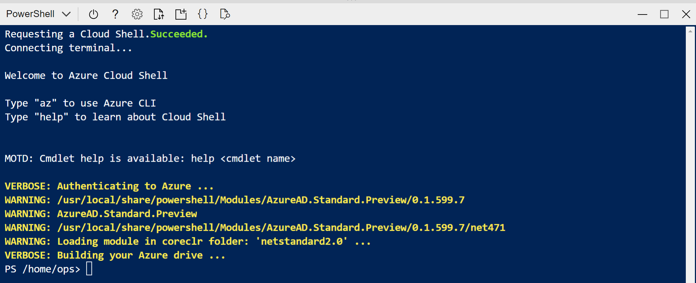


- C2. Install The Azure CLI Machine Learning extension v2 (aka az ml)
    
    ``` bash
    az extension add -n ml -y --version 2.2.1
    ```
    
- C3. Login the CLI to Azure

    - Run the following command from the Terminal

        ```bash
        az login
        ```
        If you have access to more than 1 tenants, it's advisable to use the syntax below with a designated tenant id to logon to the right tenant
        ```bash
        az login --tenant "<YOUR_TENANT_ID>"
        ```
    - You need to follow the guide to use `az cli` for the lab

        

        After copying the __code__ from the terminal, open a new tab, go to the link, [https://microsoft.com/devicelogin](https://microsoft.com/devicelogin).
        
        Use the code and follow the instructions to finish the login.

- C4. After logging into the `az cli`, come back to your terminal and configure the subscription and Azure Machine Learning Workspace by running the following commands:

    ```bash
    az account set -s "<YOUR_SUBSCRIPTION_NAME>"
    az configure --defaults group="<YOUR_RG_NAME>" workspace="<YOUR_AML_NAME>" location="<YOUR_REGION_NAME>"
    az configure -l -o table
    ```
    
> Note: You can find the __Resource Group Name, Azure Machine Learning Name__ and __the Location__ from the user profile in the AML Studio.


- The results will look like the following:
    

- C5. Clone your 'MLOpsTemplate' repo and setup your environment
    - Before you run following command, upate __{YOURGITHUBACCOUNT}__ part
    - Sample command looks like following

    ```bash
    git clone https://github.com/{YOURGITHUBACCOUNT}/MLOpsTemplate.git
    cd ./MLOpsTemplate/src/workshop
    ```

    - Upgrade pip to this specific version:

    ``` bash
    python -m pip install pip==21.3.1
    ```
    
    - Using pip, we will install some required packages to run this workshop

        ```bash
        pip install -r requirements-local.txt
        ```

- C6. Generate and register data for the workshop
    - Update arguments __"NAMES and ID"__ accordingly and then run following commands from your local terminal
        > You should run the commands from the path, __'MLOpsTemplate/src/workshop$'__

        ```bash
        python ./data/create_datasets.py --datastore_name workspaceblobstore --ml_workspace_name "AML_WS_NAME" --sub_id "SUBSCRIPTION_ID" --resourcegroup_name "RG_NAME"
        ```

- C7. Create Service Principal

    > If you have a Service Principal, please use the existing one. Ignore this step and go to next step 4.
    > If you don't have the Service Principal, please follow this step.
        
    - Get following information

        - Your Azure SubscriptionID
        - Resource Group Name

    - Update Run following command from the terminal

    ```bash
    az ad sp create-for-rbac --name {REPLACE_SPNAME} --role contributor --scopes /subscriptions/{REPLACE_SUBSCRIPTIONID}/resourceGroups/{REPLACE_RESOURCEGROUPNAME} --sdk-auth
    ```

    

    > IMPORTANT: copy/save the entire json output of that command, we will need this to setup the GitHub Secret that will enable to login into Azure using this Service Principal

    > Note: Once done, leave the terminal open. Do not terminate it yet


## 4. Configure secret in your Github account

The last two tasks include:
   - Creating a Personal Access Token (PAT) in Github
   - Adding a Service Principal (SP) to your forked repository in Github


### 4.1 Create PAT (Personal Access Token)

You are going to create PAT to allow your code access your personal git repo

- To make PAT, you need to go to Settings of your account, NOT repo setting

    

- From the setting, find and __click__ '_<> Developer settings_' menu at the bottom left conner of your screen

    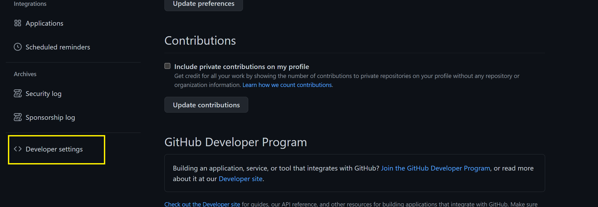

- __Click__ '_Personal access token_' and __click__ '_Generate new token_'

    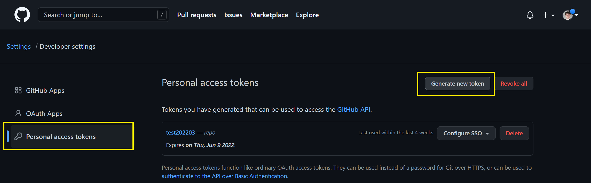

- Check for '_repo_' and '_workflow_' for the scope and then __click__ '_create_' at the bottom of your screen

    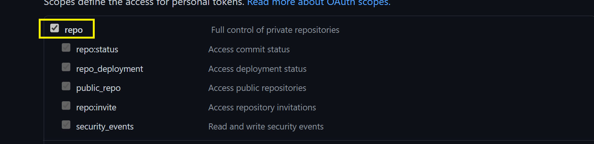

- You'll see the token. Make sure you copy and keep it safe. 

    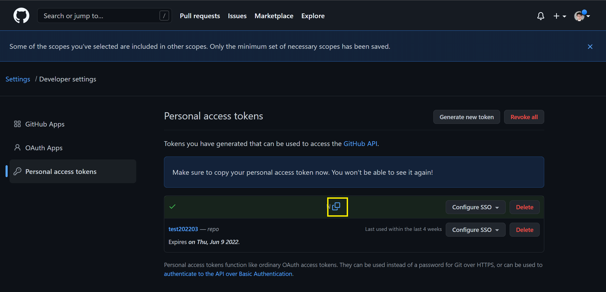

- Now you're going to add the token to your repo

- Go back to your 'MLOpsTemplate' repo where your forked from microsoft/MLOpsTemplate

    - The url of your repo will looks like this

        ```text
        https://github.com/{YOURACCOUNT}}/MLOpsTemplate
        ```

- From your repo __click__ '_Setting_'

    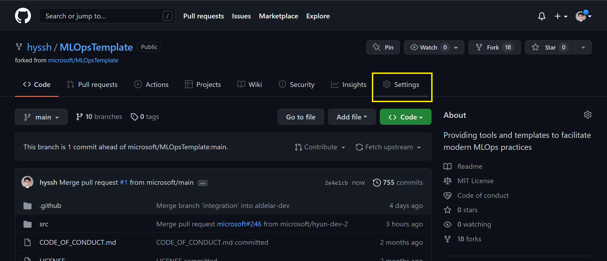

- Find a menu '_Secrets_' on the left side of menu, and __click__ 'Actions'. After that __Click__ 'New repository secret'

    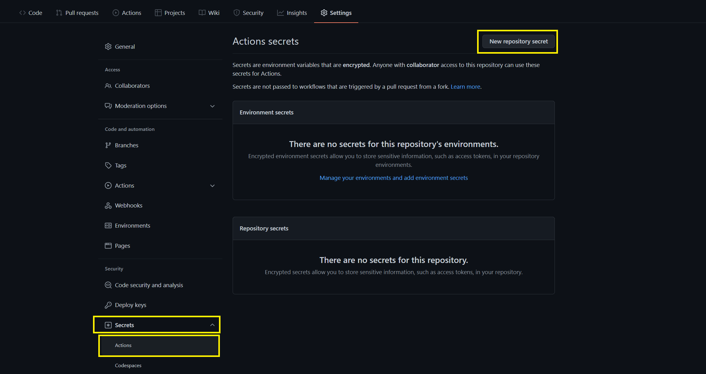

- Type `USER_NAME_GITHUB_SECRET` for the name of the secret, and paste the token you copied from PAT section

    > Important: The name for this secret must be `USER_NAME_GITHUB_SECRET`

    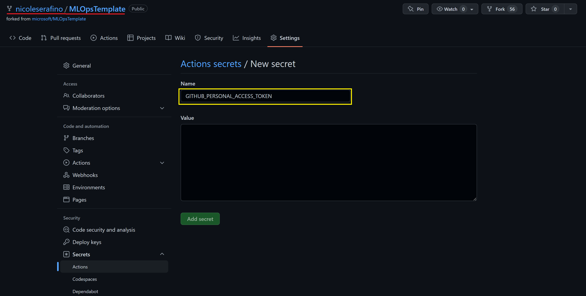


### 4.2 Add SP to your repo in Github

From this section, you'll add the SP information to your repo. The SP information will be used during the Github Actions.

You have saved in step A9, B9 or C7 the output of the SP creation command, it should look like this:

```json
{
	"clientId": "YOUR_APP_ID",
	"clientSecret": "YOUR_CLIENT_SECRET",
	"subscriptionId": "SUB_ID",
	"tenantId": "TENANT_ID",
	"activeDirectoryEndpointUrl": "https://login.microsoftonline.com",
	"resourceManagerEndpointUrl": "https://management.azure.com/",
	"activeDirectoryGraphResourceId": "https://graph.windows.net/",
	"sqlManagementEndpointUrl": "https://management.core.windows.net:8443/",
	"galleryEndpointUrl": "https://gallery.azure.com/",
	"managementEndpointUrl": "https://management.core.windows.net/"
}
```

- Go back to your 'MLOpsTemplate' repo where your forked from microsoft/MLOpsTemplate

    - The url of your repo will looks like this

        ```text
        https://github.com/{YOURACCOUNT}}/MLOpsTemplate
        ```

- From your repo __click__ '_Setting_'

    

- Find a menu '_Secrets_' on the left side of menu, and __click__ 'Actions'. After that __Click__ 'New repository secret'

    

- Type `AZURE_CREDENTIALS_USERNAME` for the name of the secret, and paste your SP json definition:

    > Important: The name for this secret must be `AZURE_CREDENTIALS_USERNAME`

    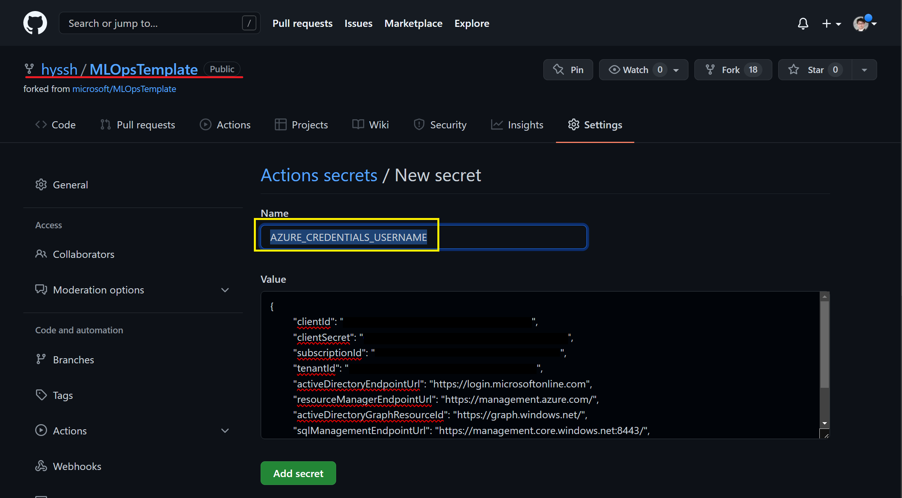


## [Go to Part 1](part_1.md)
