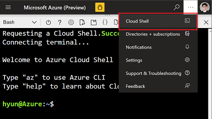
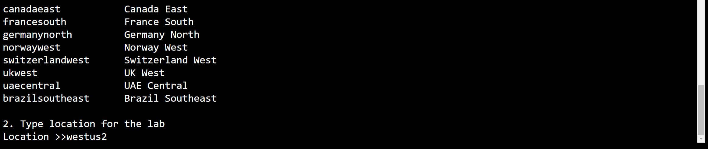

# Part 0: Workshop Environment Setup 

## Goal 

- Setup Azure ML workspace and components
- Setup github account and settings
- Setup local python development environment 
- Generate and register data for the workshop

## Pre-requisites
- Familarity with git command, branch concept 
- Knowlege of python programming, Pandas and Scikit-learn
- Conda

## Tasks

    1. Create resources in Azure

    2. Setup github account and settings

    3. Choose and setup your development environment

### 1. Create resources in Azure

To create resources you need Owner role or Contributor role. If you don't have one of role you can't run the script. So make sure you have proper role. 

- Go to [Azure Portal](https://portal.azure.com) and open __Cloud Shell__
    
    

- Change directory to `$HOME/clouddrive'
    > Note: This is cloudshell path.

    ```bash
    cd $HOME/clouddrive
    ```

- Run following command to clone repo
    ```bash
    git clone https://github.com/microsoft/MLOpsTemplate.git
    ```
- Change directory to `$HOME/clouddrive/MLOpsTemplate/src/workshop/documents/IaC/`
- Run `iac_mlopsworkshop.azcli`

    1. Read message carefully and hit `Enter` key to move next step.
        

    1. Type your Subscription Name. Note that it's __CaSE SeNSiTivE__.
        

    1. Type region where you want to create the resources. Default region is `westus2`.
        
    
    1. The script will run 5 to 7 mintues.
        > Note that this script will create SP (Service Principal) under scope of your resource group.
        >
        > Save the Service Principal `ClientID(AppId)`, `Password` in a safe place

        

> IMPORTANT: If this script failed, you can't do following labs.
>
> Reach out to CSA to get help. 

### 2. Setup github account and settings

- Setup your github account if you don't have one
- Create a new repo 
- Push the downloaded repo (https://github.com/microsoft/MLOpsTemplate) to the your new repo

### 3. Choose your development environment

    Choose an option between options A or B. 

#### Option A. Use Compute Instance for code development
- Go to your Compute Instance in your Azure Machine Learning Workspace

- Clone this git repo from the Terminal of Compute Instance
    > Note: Make sure you're running the command from the path like following. This is path in your Compute Instance
    >> `~/cloudfiles/code/User/{YOURALIAS}$`

    

- Generate and register data for the workshop
    - run following commands

        ```bash
        cd ./MLOpsTemplate/src/workshop
        conda activate azureml_py38
        python ./data/create_datasets.py --datastore_name workspaceblobstore
        ```

#### Option B. Use your local/on-premises for code development
- Create local python development environment
    - Use VSCode for python if possible
    - Using conda, create a new virtual environment or use an existing virtual environment with azureml-sdk, pandas, sckit-learn
    - Create a local project folder in your local computer
    - cd to MLOpsTemplate\src\workshop
- Generate and register data for the workshop
    - run ```python data/create_datasets.py --datastore_name YOUR_DATA_STORE_NAME```. You can also change default datastore_name inside the create_dataset.py script 


## Reference materials

---

## [To Next Part 1](https://github.com/microsoft/MLOpsTemplate/blob/hyun-dev/src/workshop/documents/part_1.md)
