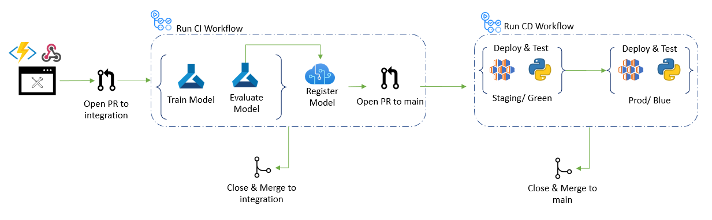

# Part 3: Use GitHub for Version Control and Automation

## Goal 
After developing a training pipeline in AML to run the feature engineering, training, and evaluation modules together that captures the training metrics and logs the models in AzureML, your team is looking at how they can leverage GitHub.

## Pre-requisites
- Complete parts 0, 1, and 2
- Familiarity with git

## Tasks
- Learn about workflows
    - A workflow is a configurable automated process made up of one or more jobs. You must create a YAML file to define your workflow configuration.
    - For this workshop, consider the CI pipeline to be the model training, and the CD pipeline to be the deployment.
- Learn about branch strategy (integration branch vs main branch)
    - The workflows will be triggered from 2 branches, the CI workflow triggered from the integration branch, and the CD workflow triggered from the main branch. The diagram also shows when the merges to these branches occur.
    - Changes and updates to the code will happen on a feature branch. When a pull request is opened to move that code to the integration branch, the CI workflow will be kicked off. This will use the updated code to train, test, and register the model. When those are succesful, the code will be merged to the integration branch, and a PR to main will be created
    - The PR to main created will trigger the CD workflow which will deploy the model. Once successful, the code will merge to main.
- Create Service Principal credentials to GitHub as a secret
    - [Add the credentials to Azure](https://docs.microsoft.com/en-us/azure/developer/github/connect-from-azure?tabs=azure-portal%2Cwindows#use-the-azure-login-action-with-a-service-principal-secret)

## The CI CD Workflow is Shown Below:
- 

## Success criteria
- Understanding of integration vs main branch and when code is pushed to each branch
- Understanding of what workflows are and how they can be triggered
- Service Principal credentials are in Github

## Reference materials
- [Workflow syntax for Github Actions](https://docs.github.com/en/actions/using-workflows/workflow-syntax-for-github-actions)