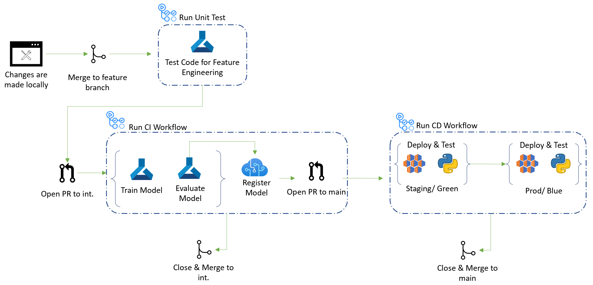

# Part 3: Use GitHub for Version Control and Automation

## Pre-requisites
- Complete [Part 0](part_0.md), [Part 1](part_1.md), [Part 2](part_2.md)

## Summary
Your team wants to learn how to automate and orchestrate common tasks such as environment setup, training, testing using GitHub Actions. To accomplish this, the following steps will be performed:
- Setup a centralized version control to keep track of project code and manage different feature development tracks and releases
- Learn how to automate and orchestrate common tasks such as environment setup, training, testing by setting up a unit test workflow to run when code is updated in your branch

## Steps
1. Move to your dev branch you created in step 1 if you are not already there.

    > Action Items: 
    > - Navigate to the repo if not already there by running ```cd PATH_TO_REPO``` with the proper path to the cloned location.
    > - Run following command to check out your "yourname-dev"
        
    ```bash
    git checkout yourname-dev
    ```


2. Create an automated unit test task that will be triggered by pushing the code to your development/feature branch. Let's use the ```Feature_Engineering``` module as the automated unit test to run to make sure the module performs correctly.

    > Action Items: Update the `workshop_unit_test.yml` file with your secret credentials. Replace the resource group, workspace and location with your specific details.
    > - Locate the file named `workshop_unit_test.yml` in the `.github/workflows` folder
    > - Make the following updates to the file: 
    >     - Update the secret name by replacing the ```MY_AZURE_CREDENTIALS``` to match the GitHub secret name for your Service Principal that was created in Part 0. (It most likely has a name similar to ```AZURE_CREDENTIALS_USERNAME```.)
    >     - Update `GROUP`, `NAME`, and `LOCATION` with the specific names of your resource group, workspace, and location created in Part 0.

3. Next, review the contents in the ```workshop_unit_test.yml``` file to understand the steps and how it is being triggered.

    - Review the trigger defined in the `on:` section to see how this workflow is being run automatically
        - The `workflow_dispatch` allows the workflow to be run manually which can be useful when testing.
        - The remaining lines highlight what is going to automatically trigger the workflow. It is being triggered on a push to any branch that is not `main` or `integration`. The changes in the push are also filtered to only include changes made to the `feature_engineering` module. 
    -  Review the job starting at the `jobs:` section that has been created already and does the following steps:
        - Checks out the repo
        - Logs into Azure
        - Creates an AML job to run feature engineering module using the [custom action](../../../.github/actions/aml-job-create/action.yaml) and the existing [feature engineering job file](../core/data_engineering/feature_engineering.yml)

4. Make changes to the `feature_engineering.yml` file to ensure job will run successful
    > Note: you may have done this in part 2, but still check the file to make sure.

    > Action Items:
    > - Locate the file named ```feature_engineering.yml``` in the ```src/workshop/core/data_engineering``` folder
    > - Replace the compute cluster name under `compute` with your specific compute cluster name (not compute instance)

5. Now that the necessary changes have been made, the changes can be pushed to your feature branch which will trigger the feature_engineering_unit_test workflow.

    > Action Items:
    > - Run the following commands in sequence to stage changes, commit them, and then push them to your repo:
    1. ```bash 
        git status
        ```
    2. ```bash 
        git add .
        ```
    3. ```bash
        git commit -am "configurations update"
        ```
    4. ```bash
        git push origin yourname-dev
        ```
        > Note: `git status` shows the files that have been modified. It is useful for seeing the latest status of the files, but isn't necessary to commit changes.

    > - Check to see if the workflow was properly triggered by going to your github repo and selecting the Actions tab.

## The CI CD Workflow is shown below:


## Success criteria
- A feature or development branch was created to track your changes
- Trigger was created on the workflow file ```workshop_unit_test.yml``` to run on a push to your feature branch
- Understand the additional updates that were made both the ```workshop_unit_test.yml``` and ```feature_engineering.yml``` file for it to use your secrets and AML resources
- Workflow was successfully triggered by pushing changes to your feature branch

## Reference materials
- [GitHub Actions](https://github.com/features/actions)
- [GitHub Actions Workflow Triggers](https://docs.github.com/en/actions/using-workflows/events-that-trigger-workflows)


## [Go to Part 4](part_4.md)
