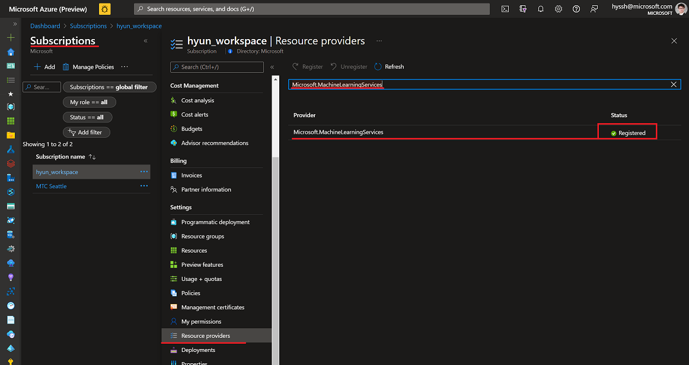

# Pre-Workshop Checklist
> Note: Review the following criteria to ensure you can complete the workshop. These are critical pieces of access to get right for a successful workshop experience.

## Azure 
1. Do you have an Azure account?

2. Do you have a `Contributor` role for your Azure Subscription?
    - If you don't, do you have a `Contributor` role for the Azure Resource Group?
         > Note: If you don't, you can't run the workshop.

3. Do you have a Service Principal?
    - If you don't, do you know the Service Principal and it's information (client id, secret)?
    - If you don't, can you ask your Cloud team to create the Service Principal for limited scope of a resource group?
         > Note: If you don't, you can't run the workshop.

4. Do you know who can help you to handle issues?

5. Do you know a person from your Cloud infra/security team who can help you:
    - Create Azure resources
    - Grant permission

6. Did you register 'Microsoft.MachineLearningServices' for your Azure subscription?
> Note: If you're not sure, go to the Azure Portal > Subscriptions > 'YourSubscription' > Resource providers' > Search 'Microsoft.MachineLearningServices'

## Github
1. Do you have a Github account?
> Note: If not, create a new account and follow the instructions in Part 0 of the workshop.

# [Go to Part 0](./part_0.md)
